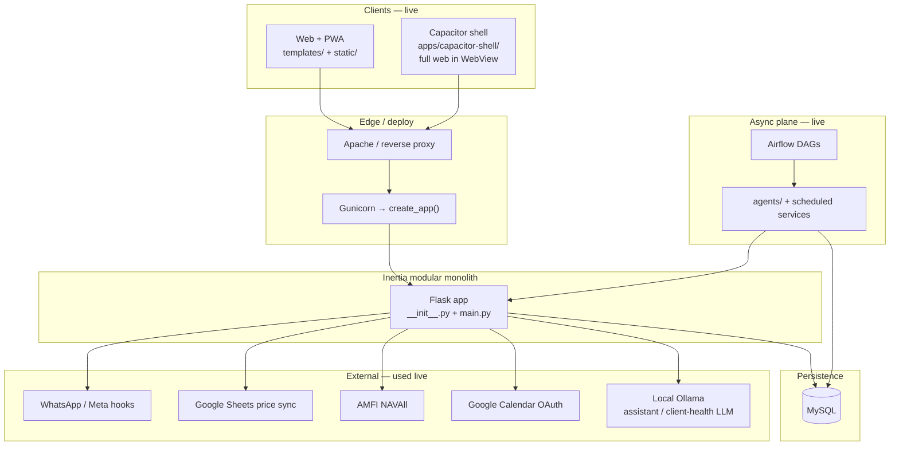
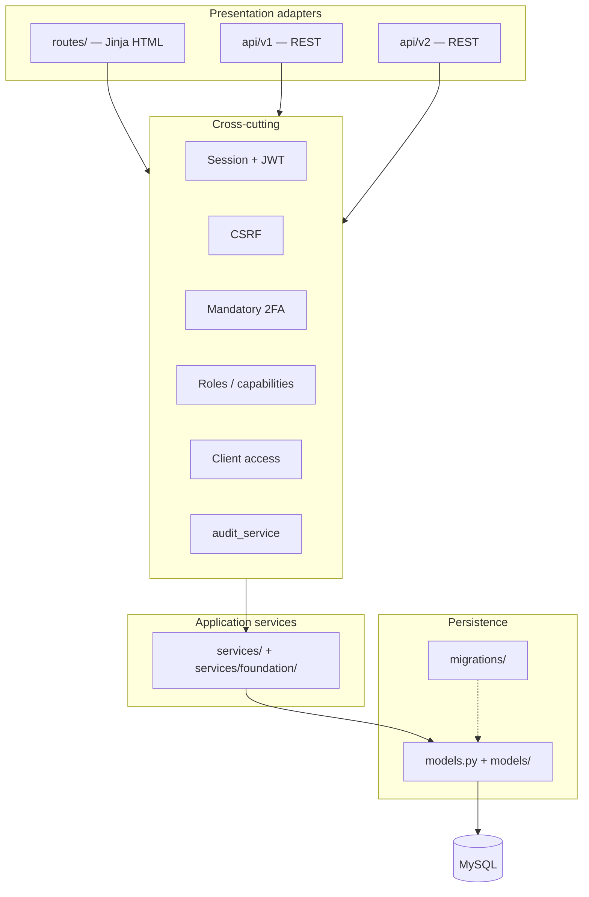
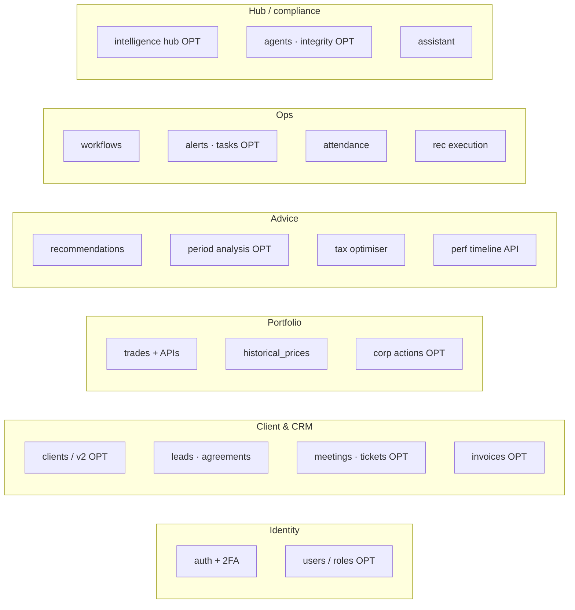

# Inertia — Live Architecture (production surfaces only)

**Purpose:** Single map of what is **actually live** in the modular monolith — not roadmap, not `_deprecated/`, not env-gated scaffolds that are off by default.

**Canonical principles / roadmap:** `docs/ARCHITECTURE_MODULES_AND_ALIGNMENT.md`  
**Nav truth:** `templates/base.html` + `docs/NAVBAR_ALIGNED.md`  
**Blueprint registration:** `__init__.py` (`create_app`)  
**API registration:** `api/v1/__init__.py`, `api/v2/__init__.py`  
**Runtime agents:** `agents/registry.py`

**Keep this doc current** when you add/remove a blueprint, API module, agent, Airflow DAG, or nav surface. See § “Agent keep-updated” below and `.cursor/rules/engineering.mdc` / `development-gate.mdc`.

**Last verified against code:** 2026-08-25

---

## 1. System context



| Client | Status |
|--------|--------|
| Web + PWA | Production |
| Capacitor (`apps/capacitor-shell/`) | Production — loads full web app |
| Expo (`apps/mobile/`) | **Not live product** — Phase 1 scaffold only |

---

## 2. Layer stack



---

## 3. Live domains (from `__init__.py`)

**CORE** = always registered. **OPT** = registered when import succeeds → `NAV_*_ENABLED=true` (production when boot succeeds).

| Domain | Live surfaces |
|--------|----------------|
| **Identity & access** | CORE: `auth`, `two_factor`, `users` · OPT: `roles` · API: `/api/v1/auth` |
| **Client & CRM** | CORE: `clients`, `leads`, `agreements`, `meetings`, `bni_referrals` · OPT: `clients_v2`, `tickets`, `invoices`, Google Calendar |
| **Portfolio & transactions** | CORE: transactions (main + APIs), `historical_prices`, cashflows (`/cashflows`, add, `/cashflow/<id>/edit`) · OPT: `corporate_actions` · engine: `forward_holding_calculation_service` |
| **Advice & reviews** | CORE: `unified_recommendations`, `recommended_trades`, `tax_optimiser_enhanced`, `pseudo_trades`, `review` · OPT: `enhanced_review` · API: performance + timeline + period analysis |
| **Workflows & ops** | CORE: `workflows`, `monthly_investments`, `alerts`, `rec_execution`, `attendance` · OPT: `tasks`, `task_assignment_rules` |
| **Analytics & hub** | CORE: practice analytics (`main`), `advisor_review` (admin metrics + manager assignment overview), `assistant` · OPT: `financial_analytics`, `intelligence_hub`, `campaign_studio` |
| **Compliance & integrity** | OPT: `data_integrity`, `agents_dashboard`, `orchestrator_dashboard`, `airflow` · agents via registry |
| **Platform & admin** | CORE: `settings` · OPT: `account_management`, `parrva`, `portfolio_performance` UI |



---

## 4. Live APIs

### `/api/v1` (`api/v1/__init__.py` `_safe_register`)

| Module | Role |
|--------|------|
| `auth`, `health` | JWT login / 2FA / me; health + ready |
| `clients`, `transactions`, `cashflows` | Client + trade + cashflow |
| `clients.cashflow_trade_integrity`, `clients.cashflow_trade_integrity_list`, `clients.guided_chat` | Cashflow↔trade integrity case (G8): from-recent trade_reconcile_from, advisor notes paste/Approve → `var/.../advisor_notes/`, calculation health + issue list + guided chat |
| `clients.data_integrity`, `clients.data_integrity_list` | Client Data Integrity umbrella (G8 + open DI issues + prices) + advisor/admin summary list |
| `performance`, `performance_timeline` | XIRR / monthly portfolio vs benchmark |
| `period_analysis` | Period analytics |
| `enhanced_tax_optimiser` | Tax optimiser API |
| `whatsapp`, `cron_jobs` | Messaging + cron hooks |
| `price_accuracy`, `public_contact` | Price scan API; public contact |
| `campaign_studio_api` | Campaign studio (when UI OPT on) |

### `/api/v2`

| Module | Role |
|--------|------|
| `period_analysis_v2` | Enhanced period analysis under `/clients` |
| `transactions_v2` | Transaction CRUD / bulk / holdings; list filters + buy/sell `summary`; traded-securities |

Shared calculations live in **services** (e.g. `forward_holding_calculation_service`); both API versions must call the same path.

---

## 5. Async plane (live)

From `agents/registry.py`:

### Runtime agents

| name | Group |
|------|--------|
| `data_integrity_manager` | portfolio_integrity |
| `rec_exec_monitor` | portfolio_integrity |
| `portfolio_performance_monitor` | portfolio_integrity |
| `client_agreement_check` | client_integrity |
| `alert_orchestrator` | ops_alerting |
| `task_assignment_agent` | ops_alerting |

### Scheduled jobs (services, not BaseAgent)

| name | Service |
|------|---------|
| `price_accuracy_scan` | `price_accuracy_service` (skips weekends / confirmed holidays / days with no firm-wide close) |
| `client_health_nightly` | `client_health_nightly_service` |
| `cashflow_trade_integrity_nightly` | `cashflow_trade_nightly_service` → badge snapshot JSON |
| `price_sheet_suppress_cycles` | `price_accuracy_sheet_suppress_service.run_sheet_suppress_cycle` → paginated sheet verify + suppress JSON + symbol leftovers |
| `client_data_integrity_nightly` | `client_data_integrity_nightly_service` → ready-made DI case/analysis snapshot (reads suppress JSON live in UI) |
| `issue_lifecycle_healer` | `issue_healer_service` |
| `task_auto_close` | `task_auto_close_service` |

**Pipeline:** `run_checks()` → `DataIntegrityIssue` → assignee → Alert Orchestrator → optional OpsTask.

---

## 6. Example live flow — Performance Timeline

**API:** `GET /api/v1/clients/<id>/performance/timeline`

| Series | Source |
|--------|--------|
| Portfolio value | `get_client_portfolio_by_date` + `HistoricalPrice` |
| Net investment | `Cashflow` |
| Benchmark DCA | `BenchmarkData` (cashflow-matched units) |

UI callers: Period Analysis V2, client details, Hub investment dashboard.

---

## 7. Explicitly not live (do not diagram as production)

| Item | Reason |
|------|--------|
| Financial planning | Off unless `FINANCIAL_PLANNING_ENABLED=true` |
| `_deprecated/` | Not imported |
| Expo full app | Scaffold only; Capacitor is live mobile |
| Nav stubs removed | See `docs/NAVBAR_ALIGNED.md` |
| Roadmap-only packages | Domain package splits still partial — see alignment doc §12 |

---

## 8. Agent keep-updated (workflow)

When any of the following change, **update this file in the same PR/commit**:

1. New/removed blueprint in `__init__.py` or `NAV_*` optional list  
2. New/removed `_safe_register` in `api/v1` or `api/v2`  
3. New/removed entry in `agents/registry.py` or Airflow DAG wired to production  
4. New primary nav / maintenance hub surface in `templates/base.html`  
5. New live external integration (WhatsApp, Sheets, AMFI, Ollama module, etc.)

**Also update** (if domains/layers change): `docs/ARCHITECTURE_MODULES_AND_ALIGNMENT.md` §3 or checklist.  
**Bump** “Last verified” date at top of this file.

**Engineering checklist item:** “`docs/ARCHITECTURE_LIVE.md` updated if live surface changed?”  
**Development gate:** Engineering unit owns this; Guideline Manager rejects docs that invent non-live features.

### How to re-verify quickly

```bash
# Blueprints / NAV flags
rg "register_blueprint|NAV_.*_ENABLED" __init__.py

# APIs
rg "_safe_register|register_blueprint" api/v1/__init__.py api/v2/__init__.py

# Agents
rg "RUNTIME_AGENTS|SCHEDULED_AGENT_LIKE_JOBS" agents/registry.py -A 2
```

---

## Related

- `docs/ARCHITECTURE_MODULES_AND_ALIGNMENT.md` — principles, gaps, roadmap  
- `docs/MOBILE_STRATEGY.md` — Capacitor vs Expo  
- `docs/NAVBAR_ALIGNED.md` — live nav only  
- `AGENTS.md` — Cursor units + runtime agents  
- `.cursor/rules/engineering.mdc` — enforce live-doc updates  
