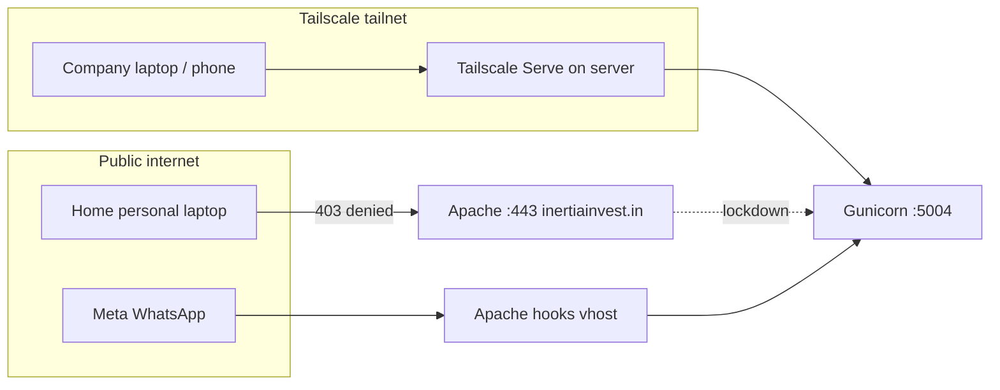

# Production cutover & staff-only access (v2026)

## Access policy (chosen)

**Approved company devices may connect from anywhere** (office or home). Personal devices without Tailscale stay blocked.

| Who | Access |
|-----|--------|
| **Home, personal browser / phone** | **Blocked** — public `https://inertiainvest.in` returns 403 |
| **Company PC / phone with Tailscale (admin-approved)** | **Allowed** — staff `*.ts.net` URL, office or home |
| **WhatsApp (Meta)** | **Public** — `hooks.inertiainvest.in` webhook only |

No static office or home IP is required.

## How it works



1. **Apache lockdown** — `inertiainvest.in` denies all UI/login on the public internet.
2. **Tailscale Serve** — app is reachable only at `https://<server>.<tailnet>.ts.net` on the tailnet.
3. **Device approval** — admin approves each company laptop/phone in the Tailscale console.
4. **Optional ACL** — only `tag:approved-device` can reach the server (`config/tailscale-acl.example.hujson`).

**Office without static IP:** install Tailscale on each **company** laptop/phone; admin approves each device. Same staff URL works at office or home.

## Prerequisites

1. v2026 deployed and healthy (`deploy_parallel_v2026.sh`).
2. Tailscale **Personal (free)** — up to **6 users**, unlimited devices per user.
3. Enable **Device approval** in [Tailscale admin](https://login.tailscale.com/admin/settings/devices).

## Phase A — Cut over HTTPS to v2026

```bash
cd /opt/Inertia2026v1
git pull origin fresh-app-2026-05-26
bash scripts/deployment/deploy_parallel_v2026.sh fresh-app-2026-05-26
bash scripts/deployment/cutover_to_v2026_prod.sh --dry-run
bash scripts/deployment/cutover_to_v2026_prod.sh
```

Rollback: `bash scripts/deployment/cutover_to_v2026_prod.sh --rollback`

## Phase B — Staff-only access

### 1. Server — install Tailscale

```bash
curl -fsSL https://tailscale.com/install.sh | sh
sudo tailscale up
tailscale status
```

In admin console → tag this machine: **`tag:inertia-server`**

### 2. Admin — device policy

| Setting | Value |
|---------|--------|
| Device approval | **On** — you approve each new device |
| Users | Invite staff (max 6 on free Personal) — **each user, not each device** |
| Devices per user | **Unlimited** on Personal (e.g. 2 laptops + desktop + phone + tablet under one login) |
| Device tags | Tag each company machine: **`tag:approved-device`** |
| ACL (optional) | Copy from `config/tailscale-acl.example.hujson` |

**ACL groups** (free plan: up to 3) are named lists of people used in rules like “only `group:inertia-admins` can SSH”. For a small team, device approval + tags are usually enough.

### 3. Lock down public site + expose tailnet URL

```bash
cd /opt/Inertia2026v1
bash scripts/deployment/enable_private_access_tailscale.sh --with-hooks --with-serve
```

This:

- Installs **public lockdown** (403 on `inertiainvest.in`)
- Installs **hooks** vhost for WhatsApp
- Runs **Tailscale Serve** → Gunicorn `127.0.0.1:5004`

Staff bookmark the URL printed by `setup_tailscale_serve.sh`, e.g.:

`https://inertia-server.your-tailnet.ts.net`

### 4. Each staff member

1. Install [Tailscale](https://tailscale.com/download) on **company** laptop/phone only.
2. Sign in with invited account; wait for admin **device approval**.
3. Open the **`*.ts.net`** staff URL (not `inertiainvest.in`).
4. Do **not** install Tailscale on personal home devices.

### 5. Verify

```bash
# From server — public should fail
curl -sI https://inertiainvest.in/auth/login | head -1   # expect 403

# From approved device with Tailscale connected
curl -sI https://YOUR-SERVER.your-tailnet.ts.net/api/v1/health   # expect 200
```

## WhatsApp webhook

Meta needs a public URL. Use the hooks vhost:

1. DNS: `hooks.inertiainvest.in` → server IP  
2. `enable_private_access_tailscale.sh --with-hooks`  
3. Meta: `https://hooks.inertiainvest.in/api/v1/whatsapp/webhook`  
4. `.env`: `WHATSAPP_WEBHOOK_URL=https://hooks.inertiainvest.in/api/v1/whatsapp/webhook`  
5. `sudo systemctl restart inertia-2026v1`

## Capacitor mobile

Company phones only — Tailscale app must be running:

```bash
# apps/capacitor-shell/.env
CAP_SERVER_URL=https://YOUR-SERVER.your-tailnet.ts.net
```

## Config reference

| File | Purpose |
|------|---------|
| `config/apache-inertiainvest-public-lockdown.conf` | Deny public `inertiainvest.in` UI |
| `config/apache-inertiainvest-hooks.conf` | Public webhook-only vhost |
| `config/tailscale-acl.example.hujson` | Optional device-tag ACL |
| `scripts/deployment/enable_private_access_tailscale.sh` | Lockdown + hooks + serve |
| `scripts/deployment/setup_tailscale_serve.sh` | Tailnet HTTPS URL only |
| `scripts/deployment/cutover_to_v2026_prod.sh` | Cutover + rollback |

## Related docs

- [PARALLEL_DEPLOY_V2026.md](PARALLEL_DEPLOY_V2026.md)
- [DEPLOY_WORKFLOW.md](DEPLOY_WORKFLOW.md)
