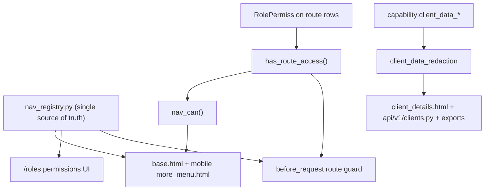

# Role-Based Menus + Client-Data Sensitivity Tiers - Implementation Reference

Status: design locked, ready to implement. This is the working reference for the change.
Owning plan: "Role-based menus and client data tiers".

## Goal

Two independent access dimensions, both built on the existing `Role` / `RolePermission`
system (no schema change - reuses `route_endpoint` rows and the `capability:` namespace):

- Dimension A - Menu / route access: a user only sees the menu items their role is
  allowed, and is blocked (server-side) from the corresponding routes. Example: a
  `research` user has no Clients / Maintenance / Admin menus.
- Dimension B - Client-data sensitivity: even for users who can open a client, PII and
  financial figures are masked unless the user has the `client_data_sensitive` capability.



## CRITICAL backward-compatibility rule (do not skip)

Today managers/advisors see menus via coarse flags (`is_manager`, `is_advisor`,
`can_manage_ops`), NOT via `RolePermission` rows. `has_route_access()` returns `False`
for a manager/advisor with no rows. If we naively gate every menu item by
`has_route_access`, every non-admin loses their menus.

Rule: a role is "menu-restricted" only if it has at least one NON-capability route
permission row. Capability rows (`capability:*`) are additive and do NOT flip a role
into restricted mode.

- Admin -> sees everything (unchanged).
- Menu-restricted role (e.g. `research`, has real `route_endpoint` rows) -> sees ONLY
  granted endpoints + universal items.
- Any other role (manager/advisor/ops with only capability rows or no rows) -> legacy
  coarse visibility preserved (no regression).

This is implemented once in `nav_can()` / the backend guard and reused everywhere.

## Policy vocabulary

- `universal`: always visible to any authenticated user. Set = dashboard/home,
  Assistant home, Ask INERTIA, User manual, Profile, 2FA, Logout.
- `permission`: visible only if the item passes `nav_can(endpoint)`.

---

## Dimension A - Menu / route access

### A1. `nav_registry.py` (new, repo root next to `utils/`)

Single source of truth mirroring the navbar. Structure:

```python
# nav_registry.py
from dataclasses import dataclass, field

@dataclass(frozen=True)
class NavItem:
    endpoint: str            # url_for target + permission key
    label: str
    icon: str = ""
    policy: str = "permission"   # or "universal"
    nav_flag: str = ""       # optional config key e.g. "NAV_TASKS_ENABLED"
    url_kwargs: dict = field(default_factory=dict)
    active_match: tuple = () # extra endpoints/prefixes that mark this item active

@dataclass(frozen=True)
class NavGroup:
    key: str                 # "clients", "maintenance", ...
    label: str
    icon: str
    items: tuple             # tuple[NavItem]
    nav_flag: str = ""       # group-level config flag (e.g. hub)

NAV_GROUPS: tuple[NavGroup, ...] = ( ... )
```

Enumerate groups/items exactly from [templates/base.html](templates/base.html)
lines 210-531 and [templates/partials/mobile/more_menu.html](templates/partials/mobile/more_menu.html):

- clients: `clients_v2.list_clients` (All Clients), `tasks.list_tasks`
  (Ops Tasks, flag `NAV_TASKS_ENABLED`), `financial_planning.dashboard`
  (flag `NAV_FINANCIAL_PLANNING_ENABLED`), `financial_analytics.dashboard`
  (flag `NAV_FINANCIAL_ANALYTICS_ENABLED`), `main.practice_analytics`,
  `leads.list_leads`, `agreements.list_templates`, `parrva.submit_page`
  (flag `NAV_PARRVA_ENABLED`), `tickets.list_tickets` + `tickets.new_ticket`
  (flag `NAV_TICKETS_ENABLED`), `invoices.list_invoices` (flag `NAV_INVOICES_ENABLED`).
- communication: `meetings.list_meetings`, `meetings.new_meeting`,
  `main.whatsapp_dashboard`, `main.whatsapp_templates`, `main.whatsapp_meta_groups`.
- maintenance: `main.data_upload_links`, `main.maintenance_trade_data`,
  `main.maintenance_reference_data`, `main.maintenance_billing`,
  `main.maintenance_recommendations`, `main.maintenance_reviews`,
  `main.maintenance_portfolio_modelling`, `main.maintenance_client_advisor_assignments`.
- dashboards: `main.list_monthly_investments`, `workflows.list_workflows`,
  `clients.list_review_schedules`.
- hub (group flag `NAV_INTELLIGENCE_HUB_ENABLED`): `hub.operational_dashboard`,
  `hub.investment_dashboard`, `hub.system_dashboard`, `hub.business_dashboard`.
- attendance: `attendance.attendance_dashboard`, `attendance.mark_attendance`,
  `attendance.user_claims`, `attendance.incentive_simulator`,
  `attendance.admin_attendance_management`, `attendance.admin_claims_management`,
  `attendance.admin_salary_calculation`.
- admin: `users.list_users`, `roles.list_roles` (flag `NAV_ROLES_ENABLED`),
  `main.database_browser`, `main.sql_query`, `settings.index`, `settings.cron_jobs`,
  `settings.system_info`, `settings.application_logs`, `settings.holdings_cycle`.
- assistant: `assistant.assistant_hub` (universal), `assistant.help_assistant_page`
  (universal), `main.user_manual_pdf` (universal), `assistant.sql_assistant_page` (admin).

Also `MENU_ENDPOINTS` = flat set of all item endpoints (used by the guard).

### A2. Permission catalog from registry - [utils/permissions.py](utils/permissions.py)

Replace the hand-maintained dict in `get_all_routes()` (lines 9-119) with a derivation
from `NAV_GROUPS`:

```python
def get_all_routes():
    from nav_registry import NAV_GROUPS
    cats = {}
    for g in NAV_GROUPS:
        cats[g.label] = [(i.endpoint, i.label) for i in g.items if i.policy != "universal"]
    return {k: v for k, v in cats.items() if v}
```

`has_route_access()` / `require_route_access()` (lines 121-146) unchanged. Result: the
`/roles` permissions UI ([routes/roles.py](routes/roles.py) `edit_role_permissions`
lines 140-190, template `roles/permissions.html`) lists every menu item grouped by menu
header, so an admin ticks exactly what a role sees.

### A3. Visibility helpers + navbar gating

New helper in [services/permission_service.py](services/permission_service.py):

```python
def role_is_menu_restricted(user) -> bool:
    ro = getattr(user, "role_obj", None)
    if not ro:
        return False
    for ep, allowed in ro.get_all_permissions().items():
        if allowed and not str(ep).startswith("capability:"):
            return True
    return False

def nav_can(user, endpoint: str, policy: str = "permission") -> bool:
    if policy == "universal":
        return True
    if not getattr(user, "is_authenticated", False):
        return False
    if getattr(user, "is_admin", False):
        return True
    if role_is_menu_restricted(user):
        return user.has_route_access(endpoint)          # allowlist mode
    # legacy coarse behaviour preserved for unrestricted roles
    return True
```

Note: legacy path returns `True` to preserve today's behaviour; existing per-group
coarse gates in the template (`can_manage_ops`, `is_admin`, config flags) stay and still
apply. So an unrestricted manager sees exactly what they see now; only restricted roles
are filtered down.

Expose to Jinja in [__init__.py](__init__.py) near line 212:

```python
from services.permission_service import nav_can as _nav_can
app.jinja_env.globals['nav_can'] = lambda ep, policy="permission": _nav_can(current_user, ep, policy)
app.jinja_env.globals['nav_group_visible'] = lambda key: _nav_group_visible(current_user, key)
```

`nav_group_visible(key)` = any item in that registry group passes `nav_can` (and its
`nav_flag`/`has_endpoint` check). Used to auto-hide an empty dropdown.

Navbar edit approach (LOW RISK - keep existing markup):
- In [templates/base.html](templates/base.html) wrap each permission dropdown `<li>`
  with `` and each item `<a>` with
  ``. Keep all existing active-state logic,
  dividers, and config-flag `` blocks. Universal items pass `'universal'`.
- Same gating in [templates/partials/mobile/more_menu.html](templates/partials/mobile/more_menu.html).
- Reconcile known desktop/mobile drift (mobile uses `hub.dashboard` + unguarded
  `main.practice_analytics`/`settings.index`; align to registry endpoints).

### A4. Backend enforcement (ships with A3) - [__init__.py](__init__.py)

Add a `before_request` guard registered after blueprints (mirrors the existing
`enforce_client_id_from_view_args` pattern in [access_control.py](access_control.py)
lines 251-268):

```python
def _enforce_menu_access():
    from flask_login import current_user
    from nav_registry import MENU_ENDPOINTS
    ep = request.endpoint
    if not ep or ep == "static" or not current_user.is_authenticated:
        return None
    if ep not in MENU_ENDPOINTS:      # only guard registry-listed menu endpoints
        return None
    if nav_can(current_user, ep):
        return None
    flash("You do not have permission to access this page.", "error")
    return redirect(url_for("main.dashboard"))
```

Guard only the endpoints present in `MENU_ENDPOINTS` (fail-closed for those; everything
else - APIs, sub-actions - is untouched to avoid breakage). Keep existing
`require_manager` etc. Note this is the real enforcement; menu hiding is UX only.

### A5. Seed `research` role - `migrations/seed_research_role.py` (new)

Idempotent, following [migrations/seed_permission_capabilities.py](migrations/seed_permission_capabilities.py):
- Create role `research` (`is_system_role=True`, no parent) if missing.
- Grant only its menu endpoints (e.g. `main.securities`, `main.models`,
  `main.list_asset_classes`, read-only analytics) via `RolePermission` rows -
  no Clients / Maintenance / Admin.
- Because it now has non-capability rows, it is auto "menu-restricted".
- Document in [docs/DB_CUTOVER_REGISTRY.md](docs/DB_CUTOVER_REGISTRY.md) (additive
  inserts, no DDL -> safe under prod DB-lag policy).

---

## Dimension B - Client-data access (ops vs sensitive, masked)

### B1. Capabilities + helpers - [services/permission_service.py](services/permission_service.py)

Add next to existing capability keys (lines 12-14):

```python
CAP_CLIENT_DATA_OPS = "capability:client_data_ops"
CAP_CLIENT_DATA_SENSITIVE = "capability:client_data_sensitive"

def user_can_view_client_ops(user) -> bool:
    return user_has_capability(user, CAP_CLIENT_DATA_OPS) or bool(
        getattr(user, "is_admin", False) or getattr(user, "is_manager", False)
        or getattr(user, "is_advisor", False))

def user_can_view_sensitive_client_data(user) -> bool:
    return user_has_capability(user, CAP_CLIENT_DATA_SENSITIVE) or bool(
        getattr(user, "is_admin", False) or getattr(user, "is_manager", False)
        or getattr(user, "is_advisor", False))
```

Expose `has_capability(cap)` Jinja global in [__init__.py](__init__.py) next to
`has_route_access`.

### B2. Shared redactor - `services/client_data_redaction.py` (new)

Reuse [services/pii_masking.py](services/pii_masking.py) (`mask_email`,
`mask_client_name`) and add:

```python
def mask_phone(v):   # "9876543210" -> "98xxxxxx10"
def mask_dob(v):     # keep year only, else "**/**/****"
def redact_client_dict(data: dict, can_view_sensitive: bool) -> dict:
    # when not can_view_sensitive: mask email/phone/dob/address/pan and
    # drop or mask financial blocks (holdings, invested, model)
```

Masked formats (locked): phone `98xxxxxx10`, email `a***@example.com`.

### B3. Apply gating + masking to surfaces

- [templates/clients/client_details.html](templates/clients/client_details.html):
  wrap PII (email ~438, phone ~442, DOB ~458) and financial detail (Recommended Trades
  ~970-1041, Holdings ~1330-1408, invoice amounts ~360-394, invested/withdrawn ~599-611)
  behind ``; show masked value
  in the ``. Status badges (ops) remain under `client_data_ops`.
- [api/v1/clients.py](api/v1/clients.py): run responses through `redact_client_dict`
  when `user_can_view_sensitive_client_data(current_user)` is False - `list_clients`
  (~106-122), `get_client` (~205-261), create/update echoes (~319-388).
- Exports: [services/holdings_report_service.py](services/holdings_report_service.py)
  (~157-197) and invoice PDF/XLSX/JSON in [routes/invoices.py](routes/invoices.py)
  (~608-912) - mask client name + drop/mask holdings & amounts when caller lacks
  sensitive; reuse `X-Export-PII-Masked` pattern from
  [services/protected_export_service.py](services/protected_export_service.py).
- Recommendation trade columns (qty / target price / amount) in
  `templates/unified_recommendations/client_recommendations.html` gated by sensitive
  capability; action/status labels remain ops.

### B4. Row scoping - [models.py](models.py)

Restore real logic (currently forced-open at lines 746-774):

```python
def can_access_client(self, client):
    if self.is_admin or self.is_manager:
        return True
    return client.advisor_id == self.id

def get_accessible_clients(self):
    if self.is_admin or self.is_manager:
        return Client.query.all()
    return Client.query.filter_by(advisor_id=self.id).all()
```

Verify the ~30 call sites of `get_accessible_clients()` still behave (advisor now sees
own clients; manager/admin unchanged). This matches the agreed single-advisor +
managers-on-top model.

### B5. Seed capability grants

Extend `migrations/seed_research_role.py` (or the capabilities seed): grant
`client_data_ops` to `research`; `client_data_sensitive` to advisor/manager/admin
(admin/manager already pass via flags, grant is explicit for auditability).

---

## Testing (`tests/unit`, prefer `pytest.mark.no_app`)

- `nav_registry` -> `get_all_routes()` derivation (groups, endpoints, universal excluded).
- `role_is_menu_restricted` (capability-only role = not restricted; route row = restricted).
- `nav_can` matrix: admin all; restricted role allowlist; unrestricted legacy pass.
- `redact_client_dict` masking (phone/email/dob, financial dropped).
- Capability helpers.
- Guard: research-role user redirected from `/clients`, reaches an allowed page.

## Gates before commit

- `python3 scripts/run_mobile_ui_check.py` (user-facing template changes).
- `python3 scripts/run_agent_approval_loop.py --write-status`.
- No DB schema change; seeds additive + idempotent (safe under prod DB-lag policy).

## Rollout order

1. A1 registry -> A2 catalog -> A3 helpers + navbar -> A4 guard -> A5 research seed.
2. B1 capabilities -> B2 redactor -> B3 surfaces -> B4 row scoping -> B5 grants.
3. Tests + gates. Commit. (Deploy separately on request.)
