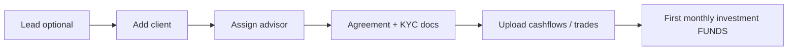
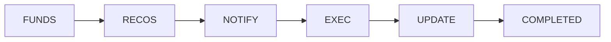

# INERTIA — User Manual

**Application:** INERTIA Equities For Wealth  
**Audience:** New advisors, ops staff, and managers  
**Last updated:** May 2026  

This manual explains how to sign in, navigate every major screen, and complete day-to-day work in the investment management system. It reflects the current top navigation in `templates/base.html`. Some menu items appear only when your role or environment enables them (see [Optional features](#18-optional-features)).

---

## Table of contents

1. [What this system does](#1-what-this-system-does)
2. [Getting started](#2-getting-started)
3. [User roles and access](#3-user-roles-and-access)
4. [Navigation overview](#4-navigation-overview)
5. [Mobile and PWA](#5-mobile-and-pwa)
6. [Home — Dashboard](#6-home--dashboard)
7. [Clients and CRM](#7-clients-and-crm)
8. [Communication](#8-communication)
9. [Maintenance (ops users)](#9-maintenance-ops-users)
10. [Dashboards](#10-dashboards)
11. [Intelligence Hub](#11-intelligence-hub)
12. [Attendance](#12-attendance)
13. [Admin](#13-admin)
14. [Your account menu](#14-your-account-menu)
15. [Client detail page (deep dive)](#15-client-detail-page-deep-dive)
16. [Core business processes](#16-core-business-processes)
17. [Alerts and SLA monitoring](#17-alerts-and-sla-monitoring)
18. [Optional features](#18-optional-features)
19. [Glossary](#19-glossary)
20. [Troubleshooting](#20-troubleshooting)
21. [Related documentation](#21-related-documentation)

---

## 1. What this system does

INERTIA is an investment advisory operations platform. In one place you can:

| Area | What you do here |
|------|------------------|
| **Clients** | Maintain client records, portfolios, agreements, and billing |
| **Investments** | Run monthly investment cycles, recommendations, and trade execution |
| **Transactions** | Record and upload trades, cashflows, and corporate actions |
| **Reviews** | Generate period analysis, performance emails, and client reviews |
| **Workflows** | Track monthly investments and other processes through defined stages |
| **Ops** | Tasks, alerts, data-integrity checks, and intelligence dashboards |
| **CRM** | Leads, meetings, tickets, invoices (when enabled) |
| **Compliance** | Audit trails, agreements, SEBI-oriented record keeping |

Currency in the UI is typically **Indian Rupees (₹)**. Large amounts may display in Lakhs/Crores on some screens.

---

## 2. Getting started

### 2.1 Sign in

**In-app manual:** After login, use **Assistant** in the top navigation bar — **Ask INERTIA** for chat help or **User manual (PDF)**. On mobile, open **More → Assistant**. Admins also see **SQL assistant** under the same menu.

1. Open the URL provided by your administrator (e.g. `https://your-company-domain/`).
2. Enter your **email** and **password**.
3. Complete **two-factor authentication (2FA)** if prompted (mandatory for most users).
4. You land on the **Dashboard** (`/dashboard`).

**Tips**

- Use **Remember me** only on trusted personal devices.
- If your session expires, you will be redirected to login; refresh and sign in again.
- After failed login attempts, contact your administrator if the account is locked.

### 2.2 Set up 2FA

1. Click your **username** (top right) → **2FA Security**.
2. Follow the on-screen steps to scan the QR code with an authenticator app.
3. Store backup codes safely if the system offers them.

### 2.3 Browser and device

| Requirement | Detail |
|-------------|--------|
| Browser | Chrome, Firefox, Safari, or Edge (current version) |
| JavaScript | Must be enabled |
| Screen | Desktop: 1024×768 minimum; phone: use mobile layout or Capacitor app |
| Internet | Stable connection for uploads and live prices |

### 2.4 Flash messages

Green, yellow, or red banners at the top of the page confirm success, warnings, or errors after an action. Read them before navigating away.

---

## 3. User roles and access

What you see depends on your role. The system **fails closed**: if you lack permission, a menu item is hidden or the page returns forbidden.

| Role | Typical access |
|------|----------------|
| **Advisor** | Assigned clients only; recommendations; workflows for those clients; attendance |
| **Manager** | Broader client visibility; practice analytics; client–advisor assignments; most ops tools |
| **Ops manager** | Maintenance menus, ops tasks, uploads, trade data (with advisor/manager) |
| **Admin** | User management, database tools, cron/logs, full system settings |

**Client assignment:** Advisors usually see only clients where they are the assigned advisor (`advisor_id` or assignment rules). Managers and admins see more.

**Maintenance menu:** Visible when you are a **manager**, **advisor**, or **ops manager** (`can_manage_ops`).

---

## 4. Navigation overview

### 4.1 Top navigation (desktop)

Click the **INERTIA logo** anytime to return to the Dashboard.

```
┌─────────────────────────────────────────────────────────────────────────────┐
│ [Logo → Dashboard]  Clients ▾  Communication ▾  Maintenance* ▾  Dashboards ▾ │
│                     Hub* ▾  Attendance ▾  Admin* ▾          [User ▾]       │
└─────────────────────────────────────────────────────────────────────────────┘
* Maintenance: managers, advisors, ops managers
* Hub / Admin: when enabled / admin only
```

| Menu | Purpose |
|------|---------|
| **Clients** | Client list, ops tasks, analytics, leads, agreements, tickets, invoices |
| **Communication** | Meetings, WhatsApp dashboard and templates |
| **Maintenance** | Hub pages for uploads, trades, reference data, recommendations, reviews, modelling |
| **Dashboards** | Monthly investments, all workflows, review schedules |
| **Hub** | Intelligence dashboards (operational, investment, system, business) |
| **Attendance** | Personal attendance; admins also manage team attendance and claims |
| **Admin** | Users, roles, database browser, SQL, system settings |
| **User (username)** | Profile, 2FA, logout |

### 4.2 How dropdowns work

- Hover or click the menu name to open items.
- The **active** page is highlighted in green in the nav bar.
- Dividers group related items (e.g. analytics vs leads).

### 4.3 Finding a feature quickly

| I want to… | Go to… |
|------------|--------|
| Open a client | **Clients → All Clients** → click name |
| Upload trades | **Maintenance → Data upload → Trade upload** |
| See monthly investment stage | **Dashboards → Monthly investments** |
| Create recommendations | **Maintenance → Recommendations → Generate** or client detail → Recs |
| Log a meeting | **Communication → New meeting** |
| Fix an SLA alert | **Dashboard** alert cards → **Alerts** list |
| Change my password | **User menu → Profile** |

---

## 5. Mobile and PWA

On phones (or the Capacitor app), a **bottom bar** replaces part of the top nav:

| Tab | Goes to |
|-----|---------|
| **Home** | Dashboard |
| **Clients** | All clients |
| **Dashboards** | Monthly investments / workflow hub |
| **Recs** | Unified recommendations |
| **More** | Offcanvas menu: maintenance, tasks, hub, settings, profile, logout |

**Client detail on mobile:** Summary cards (health, portfolio value) and **quick actions** (Recs, Workflow, Review). Scroll down or tap **All tabs** for the full desktop sections.

**Install as app:** Use the browser “Add to Home Screen” / PWA install prompt where available.

---

## 6. Home — Dashboard

**Path:** `/dashboard`  
**Nav:** Logo or **Home** (mobile)

### What you see

Summary **cards** (clickable) typically include:

| Card | Meaning | Typical action |
|------|---------|----------------|
| Total clients | Count you can access | Opens client list |
| Total AUA | Assets under advice | Informational |
| Equity AUA | Equity portion of AUA | Informational |
| Pending invoices | Draft + sent invoice value | Billing follow-up |
| Pending / delayed reviews | Review workload | Period analysis or review tools |
| Practice analytics | Manager-only practice view | Full analytics dashboard |
| System alerts | SLA and process alerts | Alert list filtered by severity |
| Lead follow-ups | Leads needing contact | Leads list |
| Open / critical tickets | Service tickets | Tickets module (if enabled) |

Lower sections may show **recent tickets**, **workflow alerts**, and quick links to alert management.

### Daily routine (suggested)

1. Open Dashboard and scan **critical alerts** and **delayed reviews**.
2. Open **Ops tasks** (if enabled) for items assigned to you.
3. Drill into **monthly investments** for clients stuck in a workflow stage.
4. Use **Clients** search for any client you need to action today.

---

## 7. Clients and CRM

**Menu:** **Clients** (dropdown)

### 7.1 All Clients

**Path:** `/clients-v2` (list; detail often `/clients/<id>`)

| Action | How |
|--------|-----|
| Search | Type in search box; results filter as you type (desktop) |
| Filter by health | Excellent / Good / Warning / Critical |
| Active only | Checkbox to hide inactive clients |
| Risk profile | Conservative / Moderate / Aggressive |
| Add client | **Add New Client** button → `/client/add` |
| Open client | Click row or card |

**Inactive clients:** Use **Mark inactive** on client detail; toggle **Active only** off on the list to see them.

### 7.2 Ops Tasks

**Path:** `/tasks` (when `NAV_TASKS_ENABLED`)

Task list with counts: active, due today, overdue, pending.

| Action | Steps |
|--------|-------|
| View task | Click task row |
| Create task | **New Task** (if you have manage permission) |
| Complete / update | Open task → update status and notes |

Tasks may be created automatically from **data integrity issues** or **review workflows** via assignment rules.

### 7.3 Client Analytics

**Path:** Financial analytics dashboard (when enabled)  
Portfolio-level analytics across clients (not the same as single-client detail).

### 7.4 Practice Analytics

**Path:** `/practice-analytics`  
**Who:** Managers or users with explicit route access.

Practice-wide metrics: client counts, AUA distribution, operational KPIs. Use **Download** where offered for exports.

### 7.5 Leads

| Screen | Path | Purpose |
|--------|------|---------|
| All Leads | `/leads` | Pipeline list |
| Add Lead | `/leads/new` | New prospect |

From a lead you can progress **workflows** (lead module) and convert to client when ready.

### 7.6 Agreement templates

**Path:** Agreement templates list (ops users)  
Manage Word/PDF templates used for client agreements. Upload templates via maintenance upload hub when applicable.

### 7.7 PaRRVA submit

**Path:** PaRRVA submission page (when `NAV_PARRVA_ENABLED`)  
Regulatory submission workflow for eligible users.

### 7.8 Service tickets

**Path:** `/tickets` (when enabled)

| Action | Steps |
|--------|-------|
| List tickets | **Clients → Service Tickets** |
| New ticket | **Clients → New Service Ticket** |
| Filter | Open / critical / by client from dashboard links |

### 7.9 Invoices

**Path:** `/invoices` (when `NAV_INVOICES_ENABLED`)  
Create and track client invoices; links from client billing sections.

### 7.10 Financial planning

**Path:** Financial planning dashboard (when `FINANCIAL_PLANNING_ENABLED=true`)  
External module integration; menu appears under **Clients** only when turned on in deployment.

---

## 8. Communication

**Menu:** **Communication**

### 8.1 Meetings

| Screen | Purpose |
|--------|---------|
| **Meetings** | List past and upcoming client meetings |
| **New meeting** | Schedule or log a meeting with client link, notes, and date |

Use meetings for review discussions, onboarding, and documented client contact (SEBI audit trail).

### 8.2 WhatsApp

| Screen | Purpose |
|--------|---------|
| **WhatsApp dashboard** | Overview of messaging integration |
| **WhatsApp templates** | Manage message templates |
| **Meta Groups API setup** | Technical setup for group messaging (if shown) |

Send client communications through approved templates; avoid ad-hoc advice outside logged channels where policy requires documentation.

---

## 9. Maintenance (ops users)

**Menu:** **Maintenance** — visible to managers, advisors, and ops managers.

Maintenance is organized as **hub pages** with large buttons linking to detailed screens. Use the hub that matches your task, then the specific tool.

### 9.1 Data upload

**Path:** `/maintenance/data-upload` (hub: `main.data_upload_links`)

| Tool | Use for |
|------|---------|
| **Trade upload** | Standard Excel/CSV trade file |
| **Cashflow upload** | Deposits, withdrawals, fees |
| **Client upload** | Bulk new clients |
| **MProfit trade upload** | Trades with company names from MProfit |
| **Securities upload** | CSV of securities master |
| **Historical price upload** | Prices, benchmarks, AMFI NAV sync |
| **Corporate actions upload** | Dividends, splits, bonuses (if module enabled) |
| **Agreement template upload** | New agreement templates |
| **Templates** | Download cashflow/client CSV templates |

**Typical upload flow:** Choose file → preview → confirm → check flash message → verify on client detail or transactions list.

### 9.2 Trade data

**Hub links:** All transactions, cashflows, historical prices, corporate actions, holdings report.

| Screen | Purpose |
|--------|---------|
| **All transactions** | Browse, edit, delete trades |
| **Cashflows** | Non-trade cash movements |
| **Historical prices** | View/edit price history |
| **Holdings report** | Cross-client holdings (permission required) |
| **Record trade** | Manual single-trade entry (card on hub) |

### 9.3 Reference data

| Screen | Purpose |
|--------|---------|
| **Asset classes** | Equity, debt, gold, etc. |
| **Securities** | Stocks, ETFs, funds; refresh prices |
| **Corporate actions** | Maintain action master |
| **Historical prices** | Browse by security |
| **Upload prices** | CSV and NAV sync |
| **Allocation models** | Asset and security model weights |

**Hot stocks** and **models** may also be linked from admin or reference hubs depending on deployment.

### 9.4 Recommendations

| Screen | Purpose |
|--------|---------|
| **All recommendations** | Unified recommendations list |
| **Generate new recommendations** | Wizard for client + amount + model |
| **Monthly investments** | Monthly cycle list (same as Dashboards entry) |
| **All recommended trades** | Line-level trades pending execution |

### 9.5 Reviews

| Screen | Purpose |
|--------|---------|
| **Period analysis V2** | Main period review tool (enhanced review module) |
| **Performance email** | Generate performance email content |
| **Portfolio modelling** | Link to construction tools |

Legacy “generate review” flows may live under review blueprints; unified recs are under **Recommendations**.

### 9.6 Portfolio modelling

| Screen | Purpose |
|--------|---------|
| **Portfolio construction** | Build target allocation for a client |
| **Position construction** | Line-level position building |

### 9.7 Assignments (managers)

**Path:** Maintenance → Assignments  
Tabs for **clients** and **leads**: assign or reassign advisor ownership.

---

## 10. Dashboards

**Menu:** **Dashboards**

### 10.1 Monthly investments

**Path:** `/monthly-investments`

Central place for the **monthly investment cycle** per client.

| Column / element | Meaning |
|------------------|---------|
| Client | Who the cycle is for |
| Stage | FUNDS → RECOS → NOTIFY → EXEC → UPDATE → COMPLETED |
| Amount | Investment amount for the month |
| Target date | Expected completion |
| Actions | Open detail, advance stage, add notes |

Click a row to open the **monthly investment detail** page with full history and **Next stage** actions.

**Stage colours (typical):**

| Stage | Colour hint | Your job |
|-------|-------------|----------|
| FUNDS | Yellow | Confirm funds received; enter amount |
| RECOS | Blue | Generate or attach recommendations |
| NOTIFY | Purple | Client informed of proposal |
| EXEC | Orange | Trades executed |
| UPDATE | Teal | Portfolio/holdings updated |
| COMPLETED | Green | Month closed |

At **RECOS**, the system often prompts for **recommendation amount** before advancing.

### 10.2 All workflows

**Path:** `/workflows` (list)

Shows workflows across modules: **lead**, **client_onboarding**, **portfolio**, **transaction**, etc.

| Filter | Use |
|--------|-----|
| Module type | Narrow to leads vs portfolios |
| Status | Active, completed, cancelled, paused |

Click a workflow to open **view workflow** with stage history and actions.

### 10.3 Reviews (schedules)

**Path:** Review schedules list (`clients.list_review_schedules`)

Set and monitor **when each client is due for a periodic review**. Tie-in with review workflow status on client detail.

---

## 11. Intelligence Hub

**Menu:** **Hub** (when `NAV_INTELLIGENCE_HUB_ENABLED`)

| Dashboard | Focus |
|-----------|--------|
| **Operational intelligence** | Ops tasks, issue queue, alert center, data integrity, recommendation execution monitor |
| **Investment intelligence** | Portfolio and investment monitoring agents |
| **System intelligence** | Jobs, Airflow, system health |
| **Business intelligence** | Practice-level metrics; may include Campaign Studio |

Use these dashboards to **triage automated issues** from agents (data integrity, rec execution, performance). Each card usually links to a filtered issue or alert list.

**Agents dashboard** (if under Tools or linked from hub): trigger and inspect **data integrity** agent runs.

---

## 12. Attendance

### 12.1 All users

| Screen | Purpose |
|--------|---------|
| **My Attendance** | View your attendance record |
| **Incentive simulator** | Model incentives (if enabled for your user) |

### 12.2 Admins only

| Screen | Purpose |
|--------|---------|
| **Mark Attendance** | Record attendance for a day |
| **My Claims** | Submit expense claims |
| **Manage Attendance** | Team attendance |
| **Manage Claims** | Approve or reject claims |
| **Salary Calculation** | Run salary from attendance rules |

Non-admin users see a single **Attendance** link without the admin submenu.

---

## 13. Admin

**Menu:** **Admin** — **admin users only**

### Access

| Item | Purpose |
|------|---------|
| **Manage Users** | Create, deactivate, reset users |
| **User Access** | Roles and permissions (`NAV_ROLES_ENABLED`) |

### Database (use with care)

| Item | Purpose |
|------|---------|
| **Database browser** | Browse tables (read-oriented) |
| **SQL query** | Ad-hoc SQL (restricted; audit usage) |

### System

| Item | Purpose |
|------|---------|
| **Settings home** | Central settings index (`/settings`) |
| **Cron jobs** | Scheduled job configuration view |
| **System info** | Version, environment info |
| **Application logs** | Log files and tail view |
| **Holdings cycle** | Holdings rebuild / cycle controls |

**Task assignment rules** and other admin tools may live under Settings or separate admin routes when enabled — configure who gets ops tasks and review assignments.

---

## 14. Your account menu

Click **username** (top right):

| Item | Action |
|------|--------|
| **Profile** | Update name, email, password |
| **2FA Security** | Manage authenticator |
| **Logout** | End session securely |

Always log out on shared computers.

---

## 15. Client detail page (deep dive)

**Path:** `/clients/<client_id>`  
**Open from:** All Clients list, dashboard links, search on detail page (“Switch Client”)

### Header actions

| Button | Effect |
|--------|--------|
| **Mark inactive / active** | Soft-hide client from default lists |
| **Next Client** | Sequential navigation |
| **Edit Client** | Demographics, risk profile, advisor |
| **Back to Clients** | Return to list |

### Major sections (scroll on desktop)

Sections appear as **cards** down the page (not separate URLs):

| Section | Contents |
|---------|----------|
| **Client health** | Score, status, active alerts, violations, recommendations |
| **Billing & agreement** | Active agreement, fee model, billing calculator, invoice history |
| **Planning synopsis / background** | Advisor notes (editable) |
| **Portfolio summary** | Value, XIRR, allocation charts |
| **Nifty benchmark** | Index level; expandable full simulation (slow — wait for load) |
| **Holdings** | Full holdings table; refresh from API |
| **Performance** | Top holdings, wealth creators, losers, sector breakdown |
| **Cashflows** | Timeline of money in/out |
| **Transactions** | Trade history; add/delete where permitted |
| **Recommendations** | Client-specific recs; generate modal |
| **Review schedule** | Next review date; set schedule modal |
| **Meetings / tickets** | Linked CRM items |
| **Documents & call logs** | Upload documents; log calls |
| **WhatsApp / comms** | Links as configured |

**Lazy sections:** Imputed dividends and calendar-year XIRR load only when you expand them (can take 30–60 seconds).

**Mobile:** Use quick actions **Recs**, **Workflow**, **Review**; tap **All tabs** to jump to desktop sections.

### Client-scoped shortcuts

| Task | Where |
|------|--------|
| Unified recommendations | Quick action or **Recs** → `/unified-recommendations/...` for client |
| Period analysis | Review quick action with `client_id` |
| Latest monthly investment | **Workflow** quick action when a cycle exists |

---

## 16. Core business processes

### 16.1 New client onboarding



1. Create **lead** (optional) → follow up in Leads.  
2. **Add client** with risk profile and contact details.  
3. **Assignments** (manager): set advisor.  
4. Upload **agreement** and documents on client detail.  
5. **Cashflow / trade upload** for opening balances.  
6. Create **monthly investment** → workflow starts at **FUNDS**.

### 16.2 Monthly investment cycle



| Step | Who | System action |
|------|-----|----------------|
| 1 | Ops/advisor | Record funds; advance to RECOS |
| 2 | Advisor | Generate recommendations; enter amount |
| 3 | Advisor | Mark client notified (email/WhatsApp/meeting logged) |
| 4 | Ops | Execute trades; update recommended trade status |
| 5 | Ops | Refresh holdings / confirm portfolio |
| 6 | Anyone | Complete; archive when month ends |

Monitor progress on **Dashboards → Monthly investments** and **Daily workflow report** (if linked from maintenance or legacy tools).

See also: `docs/WORKFLOW_SYSTEM_GUIDE.md`.

### 16.3 Investment recommendations (unified)

1. **Maintenance → Recommendations → Generate**, or client detail → **Generate recommendations**.  
2. Select client, amount, and model constraints.  
3. Review proposed trades; adjust if policy allows.  
4. Send to client (NOTIFY stage) and record approval.  
5. **Execute** via recommended trades screen or transaction entry.  
6. Confirm holdings updated.

### 16.4 Client review (periodic)

1. Check **review schedule** on client or **Dashboards → Reviews**.  
2. Open **Period analysis V2** (Maintenance → Reviews).  
3. Select client and period; run analysis.  
4. Use **Performance email** for client-ready narrative where applicable.  
5. Log **meeting** when review is discussed.  
6. Update review workflow status: **initiated → sent → meeting → closed** (where review workflow is used).

### 16.5 Portfolio rebalancing

1. Review allocation drift on **client detail** or **portfolio construction**.  
2. Generate recommendations (sell/buy lines).  
3. Client approval → execute trades → verify allocation vs model.

### 16.6 Service ticket resolution

1. **New Service Ticket** from client context or menu.  
2. Assign owner; set priority.  
3. Work ticket; add notes.  
4. Close ticket; dashboard counts update.

---

## 17. Alerts and SLA monitoring

Alerts flag **delays** in workflows and recommendations against configured SLAs.

### Access

| Entry | Path |
|-------|------|
| Dashboard cards | Click alert counts |
| Alert list | `/alerts` |
| Alert dashboard | `/alerts/dashboard` (management view) |
| Hub | Operational → Alert center |

### Severity

| Level | Typical meaning |
|-------|-----------------|
| **Critical** | SLA breached; immediate action |
| **Warning** | Approaching SLA deadline |
| **Info** | Informational |

### Actions on an alert

1. **Acknowledge** — you are working on it.  
2. **Resolve** — add notes and close.  
3. **Escalate / assign** — pass to manager or colleague (where available).  
4. Fix underlying workflow stage, then resolve.

### Default workflow SLAs (indicative)

| Transition | Typical SLA |
|------------|-------------|
| FUNDS → RECOS | 2 days |
| RECOS → NOTIFY | 3 days |
| NOTIFY → EXEC | 2 days |
| EXEC → UPDATE | 1 day |
| UPDATE → COMPLETED | 1 day |

Exact thresholds are configured in `sla_configuration` and may differ per deployment.

See: `docs/ALERT_SYSTEM_README.md`.

---

## 18. Optional features

Your menu may omit items below if the module failed to load or is disabled in config.

| Feature | Config flag | Menu location |
|---------|-------------|---------------|
| Client analytics | `NAV_FINANCIAL_ANALYTICS_ENABLED` | Clients |
| Service tickets | `NAV_TICKETS_ENABLED` | Clients |
| Corporate actions | `NAV_CORPORATE_ACTIONS_ENABLED` | Maintenance / reference |
| Enhanced review tools | `NAV_ENHANCED_REVIEW_ENABLED` | Maintenance → Reviews |
| Invoices | `NAV_INVOICES_ENABLED` | Clients |
| Ops tasks | `NAV_TASKS_ENABLED` | Clients |
| Intelligence Hub | `NAV_INTELLIGENCE_HUB_ENABLED` | Hub |
| Agents dashboard | `NAV_AGENTS_DASHBOARD_ENABLED` | Hub / tools |
| Data integrity UI | `NAV_DATA_INTEGRITY_ENABLED` | Hub |
| Airflow UI | `NAV_AIRFLOW_ENABLED` | Hub / admin |
| PaRRVA | `NAV_PARRVA_ENABLED` | Clients |
| Financial planning | `NAV_FINANCIAL_PLANNING_ENABLED` | Clients |
| Roles admin | `NAV_ROLES_ENABLED` | Admin |
| Account management | `NAV_ACCOUNT_MANAGEMENT_ENABLED` | Tools / hub |
| Campaign Studio | `NAV_CAMPAIGN_STUDIO_ENABLED` | Business hub |

If you expect a menu item and do not see it, ask your administrator whether the module is enabled in production.

---

## 19. Glossary

| Term | Meaning |
|------|---------|
| **AUA** | Assets under advice — total client portfolio value advised |
| **XIRR** | Extended internal rate of return — performance measure |
| **Workflow** | Tracked process with stages (e.g. monthly investment) |
| **Unified recommendations** | Single workflow for generating and executing model-based trades |
| **Ops task** | Internal to-do, often from alerts or integrity issues |
| **Model** | Asset or security allocation template |
| **Rec / RECOS** | Recommendation stage of monthly investment |
| **SLA** | Service level agreement — max time allowed in a stage |
| **PaRRVA** | Regulatory reporting integration (when enabled) |

---

## 20. Troubleshooting

| Problem | Try this |
|---------|------------|
| Cannot log in | Check email/password; complete 2FA; contact admin if locked |
| Page 403 Forbidden | You lack role or client assignment; ask manager |
| Menu item missing | Module not enabled — see [Optional features](#18-optional-features) |
| Upload failed | Check CSV format against template; read flash error; fix row errors and re-upload |
| Holdings look wrong | Confirm trades and cashflows; refresh holdings; check corporate actions |
| Alert action fails | Refresh page; re-login; ensure you have permission on that alert |
| Slow client detail | Avoid expanding heavy sections unless needed; use desktop for full analysis |
| Mobile layout broken | Force refresh; clear cache; use **More** menu for secondary routes |
| CSRF error on submit | Refresh, log out/in; do not use back button after long idle |

**Support path:** Team lead → system administrator → technical support.  
**Logs (admin):** Admin → Application logs.

---

## 21. Related documentation

| Document | Topic |
|----------|--------|
| `docs/WORKFLOW_SYSTEM_GUIDE.md` | Monthly workflow stages and cleanup |
| `docs/ALERT_SYSTEM_README.md` | Alerts and SLA technical detail |
| `docs/REVIEW_SYSTEM_README.md` | Review generation and Airflow |
| `docs/TRANSACTION_UPLOAD_README.md` | Trade file formats |
| `docs/AGREEMENT_MODULE_README.md` | Client agreements |
| `docs/NAVBAR_MODULES.md` | Menu ↔ code map (for admins) |
| `docs/SEBI_PROCESS_INSTRUCTIONS.md` | Compliance-oriented process |
| `MENU_QUICK_REFERENCE.md` | Legacy menu reference (may differ slightly) |
| `docs/MOBILE_STRATEGY.md` | Capacitor and mobile app |

---

*The PDF is generated from this file. After editing `docs/USER_MANUAL.md`, run `python3 scripts/build_user_manual_pdf.py` before deploy (or let the server rebuild automatically when the PDF is older than the markdown).*

*Report outdated sections when the navigation changes.*
